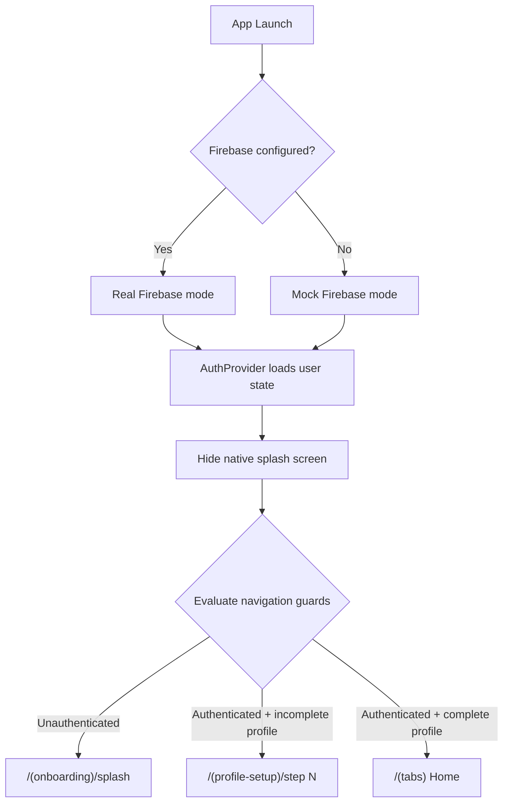
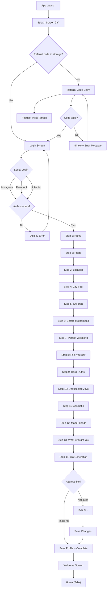
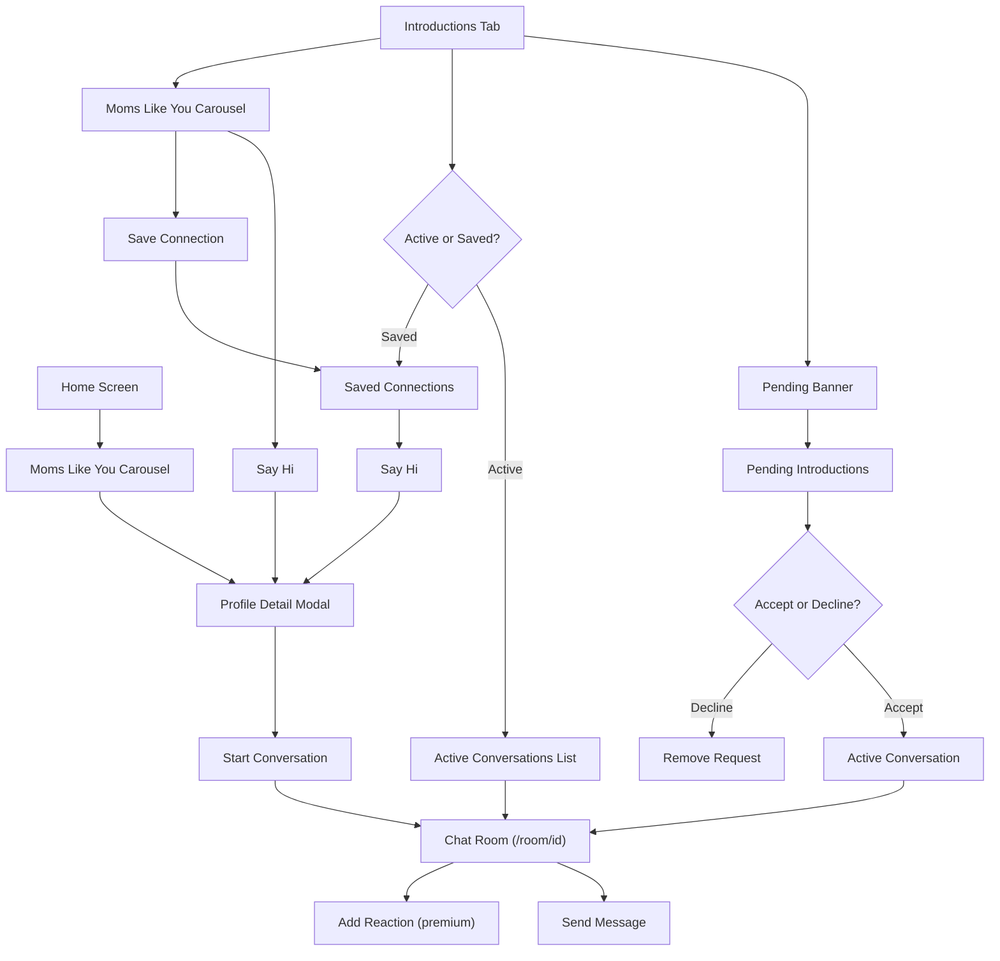
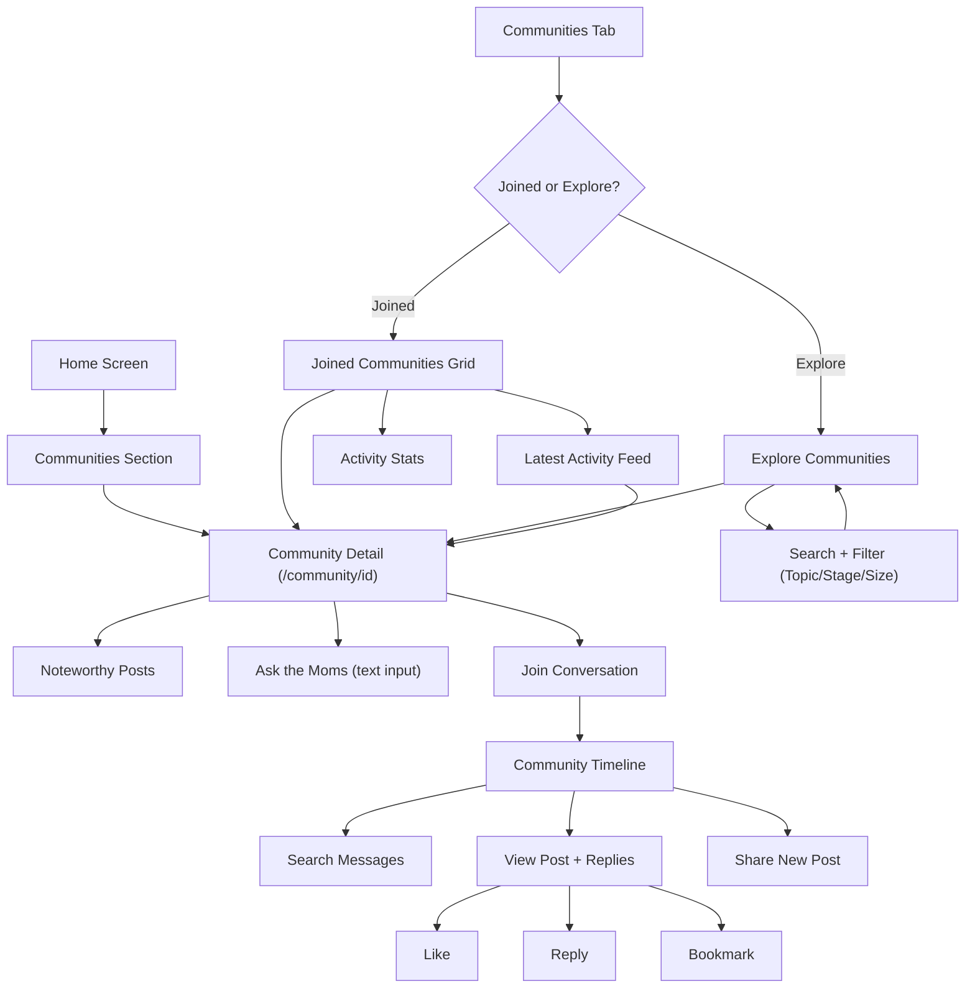
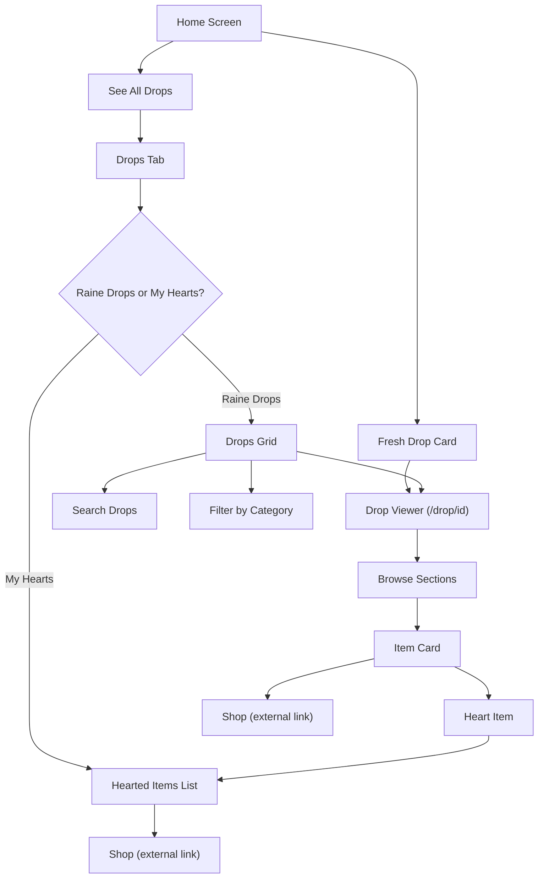
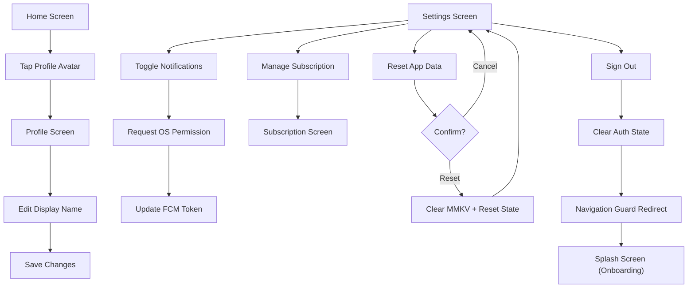

# User Flows

> How users move through Raine from first launch to daily engagement.

This document maps every primary user journey in the Raine mobile application, tracing the screens, decisions, and navigation guards that govern each flow. Each section includes a Mermaid flowchart for visual reference.

---

## Table of Contents

1. [Navigation Architecture](#1-navigation-architecture)
2. [Flow 1: New User Onboarding](#2-flow-1-new-user-onboarding)
3. [Flow 2: Social Discovery (Introductions)](#3-flow-2-social-discovery-introductions)
4. [Flow 3: Communities](#4-flow-3-communities)
5. [Flow 4: Drops](#5-flow-4-drops)
6. [Flow 5: Settings and Sign Out](#6-flow-5-settings-and-sign-out)

---

## 1. Navigation Architecture

The root layout (`_layout.tsx`) acts as a centralized navigation guard that evaluates three conditions on every segment change. These guards run after the auth loading state resolves and the native splash screen is hidden.

### Guard Conditions

| Priority | Condition | Action |
|----------|-----------|--------|
| 1 | **Unauthenticated** -- `isAuthenticated` is `false` and user is not already in `(onboarding)` or `(auth)` group | Redirect to `/(onboarding)/splash` |
| 2 | **Authenticated, profile incomplete** -- `isAuthenticated` is `true`, `profileCompleted` is `false`, and user is not already in `(profile-setup)` group | Redirect to the profile-setup step matching `currentStep` via the `STEP_TO_ROUTE` map (defaults to `/(profile-setup)/name`) |
| 3 | **Authenticated, profile complete** -- `isAuthenticated` is `true`, `profileCompleted` is `true`, and user is still in `(onboarding)`, `(auth)`, or `(profile-setup)` (excluding the `welcome` screen) | Redirect to `/(tabs)` (Home) |

### Initialization Sequence

Before guards execute, the root layout performs the following setup:

1. **Firebase check** -- Detects whether Firebase is properly configured. If not (common in development), enables mock mode automatically.
2. **Provider wrapping** -- Wraps the app in `QueryClientProvider` and `AuthProvider`.
3. **Remote config** -- Initializes Firebase Remote Config on mount.
4. **RevenueCat** -- Configures RevenueCat for subscription management, then identifies the user once `uid` is available.
5. **Push notifications** -- Registers a listener for notification-opened events and checks for an initial notification (deep-links to `/room/[id]`).
6. **Splash hide** -- Once `isLoading` resolves to `false`, the native splash screen is hidden and the guard logic begins.

### Route Groups

| Group | Purpose |
|-------|---------|
| `(onboarding)` | Splash screen, referral code entry |
| `(auth)` | Social login, terms of service |
| `(profile-setup)` | 14-step profile wizard, welcome screen |
| `(tabs)` | Main app tabs: Home, Introductions, Communities, Drops |
| Top-level screens | `profile`, `room/[id]`, `drop/[id]`, `introduction/[userId]`, `introduction/pending`, `community/[id]`, `subscription` |

---

## 2. Flow 1: New User Onboarding

The onboarding flow gates new users through a referral code system before allowing authentication. Raine is invite-only; users must either possess a valid referral code or request an invite.

### 2.1 Splash Screen

- Displays the Raine splash image for **4 seconds** (configurable via `SPLASH_DURATION_MS`).
- After the timer, checks local storage (MMKV) for a previously validated referral code.
  - **Code found**: Skips referral entry, redirects to `/(auth)/login`.
  - **No code found**: Redirects to `/(onboarding)/referral`.

### 2.2 Referral Code Entry

- Presents a 7-character OTP input with auto-focus.
- On code completion, calls `validateReferralCode()` against the backend.
  - **Valid**: Persists the referral code and timestamp to MMKV, then redirects to `/(auth)/login`.
  - **Invalid**: Displays an error message with a shake animation; input resets.
- Users without a code can tap "Request an invite" to open a pre-filled email to `access@raineapp.com`.

### 2.3 Social Login

- Offers three social authentication providers: **Instagram**, **Facebook**, and **LinkedIn**.
- Each provider calls its respective sign-in service (`signInWithInstagram`, `signInWithFacebook`, `signInWithLinkedIn`).
- In development, Firebase mock mode provides simulated authentication.
- On successful sign-in, the `AuthProvider` updates `isAuthenticated` to `true`, triggering the navigation guard to redirect to profile setup.
- The login screen also provides a "Reset app data" action (clears MMKV storage and resets profile setup state) and links to Terms of Service and Privacy Policy.

### 2.4 Profile Setup (14 Steps)

After authentication, users complete a 14-step profile wizard. Each step is mapped via the `STEP_TO_ROUTE` constant:

| Step | Route | Content |
|------|-------|---------|
| 1 | `/name` | First name and last initial |
| 2 | `/photo` | Profile photo upload |
| 3 | `/location` | Zip code and city (approved Bay Area counties) |
| 4 | `/city-feel` | How the city feels (Rooted, Still finding footing, Like a local) |
| 5 | `/children` | Number of children, names, ages, expecting status |
| 6 | `/before-motherhood` | Pre-motherhood interests (Travel, Hosting, Movement, Nature, Culture, Career) |
| 7 | `/perfect-weekend` | Weekend preferences (Adventure, Slow Mornings, Good Company, Discovery, Movement, Family) |
| 8 | `/feel-yourself` | What makes you feel like yourself (Alone time, Partner time, Friends night, Change of scenery) |
| 9 | `/hard-truth` | Hardest truths about motherhood (multi-select from 6 options) |
| 10 | `/unexpected-joys` | Unexpected joys of motherhood (multi-select from 6 options) |
| 11 | `/aesthetic` | Personal aesthetic preference with color swatches |
| 12 | `/mom-friends` | Mom friendship style (Coffee dates, Playdates, Group hangouts, etc.) |
| 13 | `/what-brought-you` | Reason for joining Raine |
| 14 | `/bio` | AI-generated bio (review, edit, or approve) |

### 2.5 Bio Generation and Completion

The final step (`/bio`) aggregates all profile data and calls `generateBio()` to produce an AI-written bio. The user can:

- **Approve** ("That's me!") -- Accept the generated bio as-is.
- **Edit** ("Not quite") -- Modify the bio text manually, then save changes.
- **Complete** -- Calls `saveProfileSetup()` to persist the full profile to the backend, marks the profile as complete in the Zustand store, and redirects to `/(profile-setup)/welcome`.

From the welcome screen, the navigation guard detects a completed profile and redirects to `/(tabs)`.

---

## 3. Flow 2: Social Discovery (Introductions)

The Introductions feature enables curated, one-to-one connections between mothers. Discovery starts on both the Home screen and the dedicated Introductions tab.

### 3.1 Discovery via Home

1. **Home screen** renders a "Moms Like You" horizontal carousel showing recommended profiles with a "Say Hi" action.
2. Tapping a profile card navigates to `/introduction/[userId]` (presented as a modal).
3. The **profile detail** screen displays the user's photo, name, location, children, tags, bio, and a match description.
4. Tapping "Start Conversation" navigates to `/room/new-[userId]`, opening a chat room.

### 3.2 Introductions Tab

The Introductions tab provides a full-featured view with:

- **Pending banner** -- Shows count and avatars of pending introduction requests. Tapping navigates to `/introduction/pending`.
- **Moms Like You carousel** -- Same recommended profiles as Home, with "Say Hi" (opens profile modal) and "Save" actions.
- **Tab switcher** -- Toggles between "Active" and "Saved" views.
  - **Active** -- Lists ongoing conversations with search, sort (Recent / A-Z), and per-row details (name, avatar, last message, timestamp). Tapping a conversation navigates to `/room/[roomId]`.
  - **Saved** -- Grid of saved connections with "Say Hi" and "Unsave" actions.
- **Badge** -- The tab icon displays a badge with the pending request count.

### 3.3 Pending Introductions

The `/introduction/pending` screen lists all pending introduction requests with:

- Profile avatar, name, and match description for each request.
- **Accept** -- Moves the introduction to active conversations, assigns a room ID.
- **Decline** -- Removes the request from the pending list.

### 3.4 Chat Room

The `/room/[id]` screen provides real-time messaging:

- Listens to Firestore messages with pagination (50 messages per batch).
- Supports text input and message sending.
- **Reactions** -- Available when the `chatReactionsEnabled` feature flag is on and the user has premium access (if `subscriptionGatingEnabled` is active). Displays a reaction picker overlay.

---

## 4. Flow 3: Communities

Communities provide group-based discussions organized by topic. Users can browse, join, and participate in community conversations.

### 4.1 Discovery via Home

1. **Home screen** displays a "Communities" section with preview cards showing community name, cover photo, and member count.
2. Tapping a community card navigates to `/community/[id]`.

### 4.2 Communities Tab

The dedicated Communities tab features:

- **Tab switcher** -- Toggles between "Joined" and "Explore".
  - **Joined** -- Displays a grid of communities the user has joined, plus activity stats (Saved Tips, Your Questions) and a "Latest Activity" feed.
  - **Explore** -- Full catalog with search bar and filter pills (Topic, Stage, Size). Communities render in a two-column grid.
- Tapping any community card navigates to `/community/[id]`.

### 4.3 Community Detail

The community detail screen (`/community/[id]`) includes:

- **Hero header** with community cover photo, name, description, and member avatars.
- **Noteworthy posts** -- Horizontal scroll of highlighted posts.
- **Ask the Moms** -- Text input for submitting a question directly.
- **Join Conversation** button -- Navigates to `/community/[id]/timeline`.

### 4.4 Community Timeline

The timeline screen (`/community/[id]/timeline`) is a threaded message board:

- Header with community name and back navigation.
- Search bar for filtering posts by content or author name.
- Post list rendered via `FlatList` with like, reply, and bookmark actions per post.
- Bottom input bar for sharing new posts.
- Community guidelines footer: "Be kind. Be helpful. We're all in this together."

---

## 5. Flow 4: Drops

Drops are curated, magazine-style content packages featuring product recommendations, tips, and editorial content. Users can browse drops, heart individual items, and shop externally.

### 5.1 Discovery via Home

1. **Home screen** features a "Fresh Drop" section with a prominent card showing the current week's drop title and description.
2. The "See All" action navigates to the Drops tab.
3. Tapping the drop card navigates to `/drop/[id]`.

### 5.2 Drops Tab

The dedicated Drops tab provides:

- **Tab switcher** -- Toggles between "Raine Drops" and "My Hearts" (with a count badge).
  - **Raine Drops** -- Search bar, category filter pills (Newborn, Toddler, Feeding, Wellness, Lifestyle, Gear), and a two-column grid of drop cover cards. Tapping a card navigates to `/drop/[id]`.
  - **My Hearts** -- A list of all previously hearted items across drops.

### 5.3 Drop Detail

The drop viewer (`/drop/[id]`) renders:

- Header with drop title (serif, italic styling) and close/back navigation.
- Color-coded cover strip.
- Subtitle description.
- **Sections** -- Each section contains a list of item cards. Each item card supports:
  - **Heart** -- Toggles the item in the hearts store. Persists the item ID, drop context, product name, photo, and shop URL.
  - **Shop** -- Opens the product's external shop URL via `Linking.openURL()`.

---

## 6. Flow 5: Settings and Sign Out

Settings are accessible from the Settings screen (hidden from the tab bar but reachable via navigation). The Profile screen allows display name editing.

### 6.1 Profile

The profile screen (`/profile`, accessible from the Home header avatar) provides:

- **Email** -- Read-only display of the authenticated user's email.
- **Display Name** -- Editable text field with a "Save changes" action that calls `updateUserProfile()`.

### 6.2 Settings

The settings screen provides the following controls:

| Control | Behavior |
|---------|----------|
| **Notifications toggle** | Toggles push notification permission. When enabling, requests OS-level permission, retrieves FCM token, and updates the user's token on the backend. |
| **Manage subscription** | Navigates to `/subscription` for RevenueCat-powered subscription management. |
| **Reset app data** | Confirmation alert. Clears all MMKV storage, resets profile setup state, clears active room ID, resets theme to `system`, and re-enables notifications. |
| **Sign out** | Calls `logout()` from `AuthProvider`. Clears the authenticated state, causing the navigation guard to redirect to `/(onboarding)/splash`. |

### 6.3 Sign Out Flow

1. User taps "Sign out" on the Settings screen.
2. `AuthProvider.logout()` clears the auth state (`isAuthenticated` becomes `false`).
3. The root layout navigation guard detects the unauthenticated state.
4. User is redirected to `/(onboarding)/splash`, restarting the onboarding flow.

---

## Cross-References

### Related Business Documents

- [Product Overview](./1-PRODUCT-OVERVIEW.md) -- High-level product vision, target audience, and feature summary.
- [Feature Specs](./3-FEATURE-SPECS/) -- Detailed specifications for each feature referenced in these flows.

### Technical Documents

- [Routing and Navigation](../TECHNICAL/7-ROUTING-NAVIGATION.md) -- Expo Router configuration, route groups, deep linking, and navigation guard implementation details.
