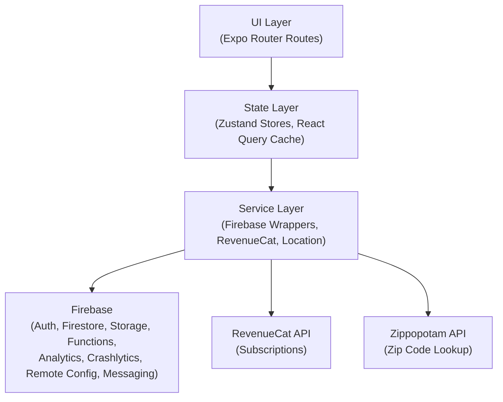
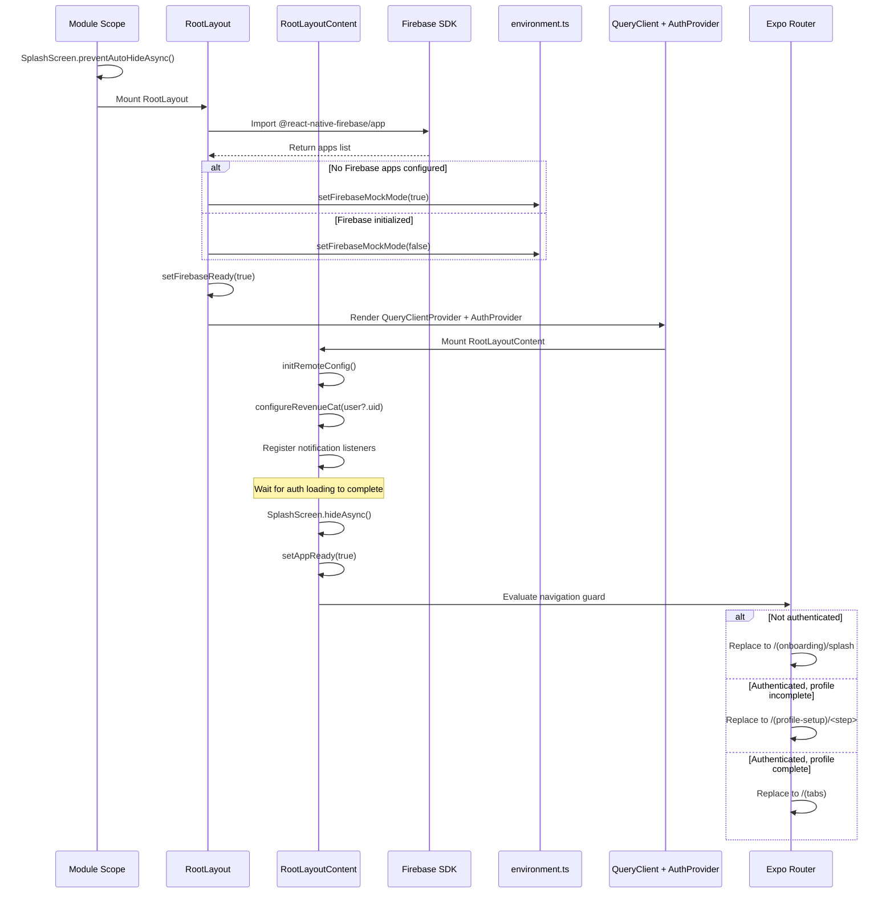

# Architecture

> Raine is a React Native mobile application built with Expo SDK 54, using file-based routing (Expo Router), Zustand for state management, and Firebase as the primary backend. This document describes the high-level architecture, tech stack, configuration, build system, and initialization sequence.

---

## 1. High-Level Architecture

The application follows a layered architecture where UI components communicate downward through state and service layers to reach external systems. No layer may bypass an intermediate layer to access a lower one directly.



**Layer responsibilities:**

| Layer | Responsibility |
|-------|---------------|
| **UI** | Screen rendering, navigation, user interaction. Expo Router file-based routes organized into route groups (`(onboarding)`, `(auth)`, `(profile-setup)`, `(tabs)`). |
| **State** | Application state via Zustand stores with MMKV persistence. Server-state caching and synchronization via TanStack React Query. |
| **Service** | Thin wrappers around external SDKs. Each service module exports a consistent API and supports mock-mode substitution in development. |
| **External** | Third-party backends and APIs consumed exclusively through the service layer. |

---

## 2. Tech Stack

| Layer | Technology | Version | Purpose |
|-------|-----------|---------|---------|
| Framework | Expo | ~54.0.33 | Managed React Native workflow, native module config plugins |
| Runtime | React Native | 0.81.5 | Cross-platform native runtime (New Architecture enabled) |
| UI Library | React | 19.1.0 | Component model and hooks |
| Routing | Expo Router | ~6.0.23 | File-based navigation with nested layouts and route groups |
| Styling | NativeWind / Tailwind CSS | ^4.2.1 / ^3.4.19 | Utility-first styling compiled to React Native StyleSheet |
| State (client) | Zustand | ^5.0.11 | Lightweight stores with MMKV persistence middleware |
| State (server) | TanStack React Query | ^5.90.20 | Async data fetching, caching, and background refetching |
| Storage (local) | react-native-mmkv | ^4.1.2 | Synchronous key-value persistence (JSI-backed) |
| Auth | Firebase Auth | ^23.8.6 | Email/password, social login (Facebook SDK) |
| Database | Cloud Firestore | ^23.8.6 | NoSQL document database for user and app data |
| File Storage | Firebase Storage | ^23.8.6 | Image and media asset storage |
| Cloud Functions | Firebase Functions | ^23.8.6 | Server-side business logic |
| Analytics | Firebase Analytics | ^23.8.6 | Event tracking and user properties |
| Crash Reporting | Firebase Crashlytics | ^23.8.6 | Crash and error reporting |
| Push Notifications | Firebase Messaging | ^23.8.6 | FCM push notifications |
| Remote Config | Firebase Remote Config | ^23.8.6 | Feature flags and remote configuration |
| Subscriptions | RevenueCat | ^9.7.6 | In-app purchase and subscription management |
| Social Auth | react-native-fbsdk-next | ^13.4.3 | Facebook Login SDK integration |
| Animations | Reanimated | ~4.1.1 | Native-thread animations and gesture handling |
| Icons | Lucide React Native | ^0.563.0 | SVG icon library |
| Images | expo-image | ~3.0.11 | High-performance image rendering with caching |
| Build | EAS Build | CLI >= 5.0.0 | Cloud-based native builds for iOS and Android |
| Language | TypeScript | ~5.9.2 | Static typing with strict mode enabled |
| Linting | ESLint + Prettier | ^8.57.1 / ^3.8.1 | Code quality and formatting enforcement |

---

## 3. Architectural Principles

### File-Based Routing

All routes are defined as files under `src/app/`. Route groups (directories prefixed with parentheses) control layout nesting and navigation structure without affecting URL paths. See [Folder Structure](./2-FOLDER-STRUCTURE.md) for the complete directory layout.

### Feature-First Organization

Source code is organized by feature domain rather than technical role. Each feature directory (`src/features/<feature>/`) co-locates its screens, components, hooks, types, and constants. Shared utilities live in dedicated top-level directories (`src/services/`, `src/store/`, `src/components/`).

### Service Abstraction

All external SDK access is encapsulated behind service modules in `src/services/`. No UI component or store imports a Firebase, RevenueCat, or third-party SDK directly. This enables mock-mode substitution without modifying consumers.

### Mock-First Development

When Firebase configuration files are absent or the app runs in `__DEV__` mode, the environment module (`src/config/environment.ts`) activates mock mode. Service modules detect this flag via `isFirebaseMockMode()` and return mock data, enabling the full UI flow to work without a configured backend. See [Mock Mode](./8-MOCK-MODE.md) for implementation details.

### Lazy Loading

Heavy service initialization (Remote Config, RevenueCat, notification listeners) is deferred to `useEffect` hooks within the root layout rather than executing at module import time. This keeps the cold-start path minimal and allows the splash screen to remain visible until essential checks complete.

### Navigation Guards

The root layout (`src/app/_layout.tsx`) implements a segment-based navigation guard that redirects users based on authentication state and profile completion:

- **Unauthenticated** users are redirected to the onboarding flow.
- **Authenticated without completed profile** users are redirected to the profile setup step they last reached.
- **Fully authenticated** users are redirected out of onboarding/auth/profile-setup groups into the main tab navigator.

See [Design Patterns](./3-DESIGN-PATTERNS.md) for a detailed description of the guard pattern.

---

## 4. Configuration Files

| File | Purpose |
|------|---------|
| `app.json` | Expo project configuration: app name, slug, bundle identifiers, platform-specific settings, native config plugins (Expo Router root, expo-dev-client, Firebase App, Crashlytics), EAS project ID, splash screen, and icon assets. |
| `eas.json` | EAS Build and Submit profiles. Defines four build profiles (`development`, `development-simulator`, `preview`, `production`) with platform-specific output formats and distribution targets. |
| `babel.config.js` | Babel transpilation: uses `babel-preset-expo` and `nativewind/babel` presets, plus the `react-native-reanimated/plugin` (must be listed last). |
| `metro.config.js` | Metro bundler configuration: extends Expo defaults and wraps with `withNativeWind` to process `global.css` as the Tailwind CSS entry point. |
| `tailwind.config.js` | Tailwind CSS configuration: scans `src/**/*.{ts,tsx}` for class usage, extends NativeWind preset. |
| `tsconfig.json` | TypeScript configuration: extends `expo/tsconfig.base`, enables strict mode, uses `react-jsx` transform and `bundler` module resolution. Includes NativeWind type declarations. |
| `global.css` | Tailwind CSS entry point: imports base, components, and utilities layers. Processed by Metro via NativeWind at build time. |

---

## 5. Build System

### EAS Build Workflow

Raine uses [EAS Build](https://docs.expo.dev/build/introduction/) for all native builds. The CLI version requirement is `>= 5.0.0`, and app versioning is sourced from local configuration (`app.json`).

### Build Profiles

| Profile | Distribution | Dev Client | iOS Output | Android Output | Use Case |
|---------|-------------|------------|------------|----------------|----------|
| `development` | Internal | Yes | Device build (no simulator) | APK | On-device development with hot reload and dev tools |
| `development-simulator` | Internal | Yes | Simulator build | N/A | iOS Simulator development without a physical device |
| `preview` | Internal | No | Device build (no simulator) | APK | Internal testing of production-like builds without dev tools |
| `production` | Store | No | Device build (no simulator) | AAB (app-bundle) | App Store / Google Play submission (auto-increments version) |

### Build Commands

```
yarn build:dev:ios              # Development build for iOS device
yarn build:dev:ios:simulator    # Development build for iOS Simulator
yarn build:dev:android          # Development build for Android device
yarn build:preview:ios          # Preview build for iOS
yarn build:preview:android      # Preview build for Android
yarn build:prod:ios             # Production build for iOS (App Store)
yarn build:prod:android         # Production build for Android (Google Play)
```

### Local Development

```
yarn start                      # Start Expo bundler
yarn dev                        # Start with dev client
yarn clean                      # Clear Metro cache and restart
yarn clean:all                  # Clear watchman, node_modules cache, and restart
yarn doctor                     # Run expo-doctor diagnostics
```

---

## 6. Initialization Sequence

The application startup follows a deterministic sequence to ensure services are ready before the UI renders and navigation decisions are made.



### Step-by-Step Breakdown

1. **Splash hold** -- `SplashScreen.preventAutoHideAsync()` runs at module scope, before any component mounts, to prevent a white flash.
2. **Firebase check** -- `RootLayout` asynchronously imports `@react-native-firebase/app` and inspects the initialized apps list.
3. **Mock mode decision** -- If no Firebase app is initialized (missing config files) or the import throws, `setFirebaseMockMode(true)` is called. Otherwise, mock mode is disabled.
4. **Provider tree** -- Once the Firebase check completes (`firebaseReady === true`), the provider tree renders: `QueryClientProvider` (TanStack React Query) wrapping `AuthProvider` (Firebase Auth listener).
5. **Service initialization** -- `RootLayoutContent` triggers side effects: Remote Config fetch, RevenueCat configuration, and notification listener registration.
6. **Auth resolution** -- The `AuthProvider` resolves the current authentication state. While `isLoading` is true, the splash screen remains visible.
7. **Splash hide** -- Once auth loading completes, the splash screen is hidden and `appReady` is set to true.
8. **Navigation guard** -- The segment-based guard evaluates the user's authentication state, profile completion status, and current route segment to determine the correct redirect target.

---

## 7. External Dependencies

The following native modules require linking and are included via Expo config plugins or auto-linking:

| Module | Purpose |
|--------|---------|
| `@react-native-firebase/app` | Firebase core initialization and native SDK bridge |
| `@react-native-firebase/auth` | Native authentication (email/password, social providers) |
| `@react-native-firebase/firestore` | Native Firestore client with offline persistence |
| `@react-native-firebase/storage` | Native file upload/download to Firebase Storage |
| `@react-native-firebase/functions` | Native callable Cloud Functions client |
| `@react-native-firebase/analytics` | Native event logging to Firebase Analytics |
| `@react-native-firebase/crashlytics` | Native crash reporting and error logging |
| `@react-native-firebase/messaging` | Native FCM push notification handling |
| `@react-native-firebase/remote-config` | Native Remote Config fetch and activation |
| `react-native-purchases` | RevenueCat native SDK for in-app subscriptions |
| `react-native-fbsdk-next` | Facebook Login native SDK integration |
| `react-native-reanimated` | Native-thread animation driver (worklet-based) |
| `react-native-screens` | Native screen containers for navigation performance |
| `react-native-safe-area-context` | Native safe area inset detection |
| `react-native-mmkv` | JSI-based synchronous key-value storage |
| `react-native-nitro-modules` | Native module bridge infrastructure |
| `react-native-worklets` | Shared worklet runtime for Reanimated |
| `expo-image` | High-performance native image component with caching |
| `expo-image-picker` | Native camera and photo library access |
| `expo-image-manipulator` | Native image resize, crop, and compression |
| `expo-dev-client` | Custom development client with enhanced debugging |
| `expo-auth-session` | OAuth/OpenID Connect session management |
| `expo-linking` | Deep link and universal link handling |
| `expo-web-browser` | In-app browser for OAuth redirect flows |
| `expo-constants` | Access to app manifest and build-time constants |
| `expo-status-bar` | Native status bar appearance control |

---

## Cross-References

- [Folder Structure](./2-FOLDER-STRUCTURE.md) -- Directory layout and file naming conventions.
- [Design Patterns](./3-DESIGN-PATTERNS.md) -- Patterns used across the codebase including navigation guards, service abstraction, and store design.
- [Mock Mode](./8-MOCK-MODE.md) -- How mock mode works, when it activates, and how service modules implement mock fallbacks.
