# Routing and Navigation

> Raine uses Expo Router for file-based navigation with route groups, dynamic segments, and centralized navigation guards. This document describes how routing works, the complete route inventory, navigation guards, tab navigation, profile setup flow, deep linking, splash screen management, and the route tree structure.

---

## 1. How Expo Router Works

### 1.1 File-Based Routing

Expo Router maps the file structure under `src/app` to URL paths. Each file corresponds to a route:

- `index.tsx` maps to the directory root (e.g. `/` or `/(tabs)`).
- `[param].tsx` defines a dynamic segment; the bracket name becomes the param key.
- `_layout.tsx` defines a layout that wraps child routes and is not a navigable screen itself.

The router root is configured in `app.json` via the `expo-router` plugin with `root: "src/app"`.

### 1.2 Route Groups

Route groups use parentheses `(name)` to organize routes without affecting the URL path. The group name is omitted from the segment path. Raine uses four route groups:

| Group | Purpose |
|-------|---------|
| `(onboarding)` | Splash, referral screens before sign-in |
| `(auth)` | Login, terms of service |
| `(profile-setup)` | 14-step profile creation flow |
| `(tabs)` | Main app tabs (Home, Introductions, Communities, Drops) |

Example: `/(onboarding)/splash` resolves to `src/app/(onboarding)/splash.tsx`, but the URL segment is `/splash` within the onboarding context.

### 1.3 Dynamic Routes

Dynamic segments use square brackets. Raine defines:

- `room/[id].tsx` — `/room/:id` (chat rooms)
- `drop/[id].tsx` — `/drop/:id` (drops)
- `community/[id].tsx` and `community/[id]/timeline.tsx` — community detail and timeline
- `introduction/[userId].tsx` — `/introduction/:userId` (modal presentation)

Parameters are read via `useLocalSearchParams<{ id: string }>()`.

---

## 2. Complete Route Inventory

| Route | File | Group | Type |
|-------|------|-------|------|
| `/` | `index.tsx` | — | Redirect |
| `/(onboarding)/splash` | `(onboarding)/splash.tsx` | (onboarding) | Screen |
| `/(onboarding)/referral` | `(onboarding)/referral.tsx` | (onboarding) | Screen |
| `/(auth)/login` | `(auth)/login.tsx` | (auth) | Screen |
| `/(auth)/terms` | `(auth)/terms.tsx` | (auth) | Screen |
| `/(profile-setup)/welcome` | `(profile-setup)/welcome.tsx` | (profile-setup) | Screen |
| `/(profile-setup)/name` | `(profile-setup)/name.tsx` | (profile-setup) | Screen |
| `/(profile-setup)/photo` | `(profile-setup)/photo.tsx` | (profile-setup) | Screen |
| `/(profile-setup)/location` | `(profile-setup)/location.tsx` | (profile-setup) | Screen |
| `/(profile-setup)/city-feel` | `(profile-setup)/city-feel.tsx` | (profile-setup) | Screen |
| `/(profile-setup)/children` | `(profile-setup)/children.tsx` | (profile-setup) | Screen |
| `/(profile-setup)/before-motherhood` | `(profile-setup)/before-motherhood.tsx` | (profile-setup) | Screen |
| `/(profile-setup)/perfect-weekend` | `(profile-setup)/perfect-weekend.tsx` | (profile-setup) | Screen |
| `/(profile-setup)/feel-yourself` | `(profile-setup)/feel-yourself.tsx` | (profile-setup) | Screen |
| `/(profile-setup)/hard-truth` | `(profile-setup)/hard-truth.tsx` | (profile-setup) | Screen |
| `/(profile-setup)/unexpected-joys` | `(profile-setup)/unexpected-joys.tsx` | (profile-setup) | Screen |
| `/(profile-setup)/aesthetic` | `(profile-setup)/aesthetic.tsx` | (profile-setup) | Screen |
| `/(profile-setup)/mom-friends` | `(profile-setup)/mom-friends.tsx` | (profile-setup) | Screen |
| `/(profile-setup)/what-brought-you` | `(profile-setup)/what-brought-you.tsx` | (profile-setup) | Screen |
| `/(profile-setup)/bio` | `(profile-setup)/bio.tsx` | (profile-setup) | Screen |
| `/(profile-setup)/out-of-area` | `(profile-setup)/out-of-area.tsx` | (profile-setup) | Screen |
| `/(tabs)` | `(tabs)/index.tsx` | (tabs) | Screen |
| `/(tabs)/introductions` | `(tabs)/introductions.tsx` | (tabs) | Screen |
| `/(tabs)/communities` | `(tabs)/communities.tsx` | (tabs) | Screen |
| `/(tabs)/drops` | `(tabs)/drops.tsx` | (tabs) | Screen |
| `/(tabs)/profile` | `(tabs)/profile.tsx` | (tabs) | Screen (hidden) |
| `/(tabs)/settings` | `(tabs)/settings.tsx` | (tabs) | Screen (hidden) |
| `/profile` | `profile/index.tsx` | — | Screen |
| `/profile/edit` | `profile/edit.tsx` | — | Screen |
| `/room/:id` | `room/[id].tsx` | — | Screen |
| `/drop/:id` | `drop/[id].tsx` | — | Screen |
| `/community/:id` | `community/[id].tsx` | — | Screen |
| `/community/:id/timeline` | `community/[id]/timeline.tsx` | — | Screen |
| `/introduction/:userId` | `introduction/[userId].tsx` | — | Screen (modal) |
| `/introduction/pending` | `introduction/pending.tsx` | — | Screen |
| `/subscription` | `subscription.tsx` | — | Screen |

| Layout | File | Type |
|--------|------|------|
| Root | `_layout.tsx` | Layout |
| Onboarding | `(onboarding)/_layout.tsx` | Layout |
| Auth | `(auth)/_layout.tsx` | Layout |
| Profile Setup | `(profile-setup)/_layout.tsx` | Layout |
| Tabs | `(tabs)/_layout.tsx` | Layout |
| Profile | `profile/_layout.tsx` | Layout |

---

## 3. Navigation Guards

The root layout (`src/app/_layout.tsx`) runs a `useEffect` that enforces three redirect conditions based on `isAuthenticated`, `profileCompleted`, `currentStep`, and the current route segments. All guards run only after `appReady` is true.

### 3.1 Unauthenticated Users

When the user is not authenticated and not already in onboarding or auth routes, redirect to the onboarding splash screen.

```tsx
if (!isAuthenticated && !inOnboardingGroup && !inAuthGroup) {
  router.replace('/(onboarding)/splash');
  return;
}
```

### 3.2 Incomplete Profile Setup

When the user is authenticated but profile setup is not completed and the user is not in the profile-setup group, redirect to the appropriate step from `STEP_TO_ROUTE`.

```tsx
if (isAuthenticated && !profileCompleted && !inProfileSetupGroup) {
  const route = STEP_TO_ROUTE[currentStep] || '/(profile-setup)/name';
  router.replace(route as any);
  return;
}
```

### 3.3 Completed Profile, Still in Auth Flow

When the user is authenticated and profile setup is completed, but the user is still in onboarding, auth, or profile-setup (except the welcome screen), redirect to the main tabs.

```tsx
const inWelcomeScreen = inProfileSetupGroup && segmentsList[1] === 'welcome';

if (
  isAuthenticated &&
  profileCompleted &&
  (inOnboardingGroup || inAuthGroup || inProfileSetupGroup) &&
  !inWelcomeScreen
) {
  router.replace('/(tabs)');
}
```

The welcome screen is excluded so users who just completed setup can remain there before manually proceeding.

---

## 4. Tab Navigation

The tabs layout (`src/app/(tabs)/_layout.tsx`) uses Expo Router's `Tabs` component with four visible tabs.

### 4.1 Tab Configuration

| Tab | Route | Icon | Badge |
|-----|-------|------|-------|
| Home | `index` | Home icon | — |
| Introductions | `introductions` | Introductions icon | `pendingCount` when > 0 |
| Communities | `communities` | Communities icon | — |
| Drops | `drops` | Drops icon | — |

### 4.2 Badges

The Introductions tab shows a numeric badge from `useIntroductionsStore((state) => state.pendingRequests.length)` when there are pending introduction requests.

```tsx
tabBarBadge: pendingCount > 0 ? pendingCount : undefined,
```

### 4.3 Icons

Each tab uses a `TabIcon` component that renders emoji-style icons (Home, Introductions, Communities, Drops) with reduced opacity when inactive.

### 4.4 Hidden Tabs

`profile` and `settings` are defined as tabs but hidden from the tab bar via `href: null`, allowing programmatic navigation while keeping them outside the visible tab bar.

---

## 5. Profile Setup Navigation

### 5.1 Step Tracking

Profile setup is a 14-step flow. The `profileSetupStore` (Zustand with MMKV persistence) holds `currentStep` (1–14) and `completed`. `STEP_TO_ROUTE` maps each step to its route:

```ts
STEP_TO_ROUTE: Record<number, string> = {
  1: "/(profile-setup)/name",
  2: "/(profile-setup)/photo",
  // ... through step 14
  14: "/(profile-setup)/bio",
};
```

### 5.2 Progress Dots

`ProgressDots` renders 14 dots; dots before `currentStep` are filled (orange), the rest are unfilled (slate). It is rendered in the profile-setup layout header.

### 5.3 Back Button

The profile-setup layout shows a back chevron when `currentStep > 1`. On press, it calls `decrementStep()` and navigates to `STEP_TO_ROUTE[previousStep]` via `router.replace()`. When on step 1, an empty spacer is shown instead to preserve layout.

### 5.4 Layout Behavior

The profile-setup stack uses `gestureEnabled: false` and `animation: 'slide_from_right'`, preventing swipe-back gestures and enforcing explicit back-button navigation.

---

## 6. Deep Linking

The app scheme is configured in `app.json`:

```json
"scheme": "raine"
```

This enables URLs such as `raine://room/abc123` or `raine://community/xyz`. The Expo Router plugin (`expo-router` with `root: "src/app"`) handles scheme resolution to the appropriate route.

---

## 7. Splash Screen Management

Splash is controlled in the root layout to avoid a visible flash before navigation:

1. **Prevent auto-hide (module level):** `SplashScreen.preventAutoHideAsync()` runs at module load, before any component renders, so the native splash stays visible.

2. **Hide on auth ready:** A `useEffect` calls `SplashScreen.hideAsync()` when `isLoading` becomes false (auth state has resolved). This also sets `appReady` to true, which triggers the navigation guards.

The splash image and background are defined in `app.json` (`splash.image`, `splash.backgroundColor`).

---

## 8. Route Tree Diagram

```mermaid
flowchart TB
    subgraph Root["/ (Root Layout)"]
        Index["index.tsx<br/>(Redirect)"]
        Onboarding["(onboarding)"]
        Auth["(auth)"]
        ProfileSetup["(profile-setup)"]
        Tabs["(tabs)"]
        Profile["profile"]
        Room["room/[id]"]
        Drop["drop/[id]"]
        Introduction["introduction"]
        Community["community/[id]"]
        Subscription["subscription"]
    end

    subgraph OnboardingGroup["(onboarding)"]
        Splash["splash"]
        Referral["referral"]
    end

    subgraph AuthGroup["(auth)"]
        Login["login"]
        Terms["terms"]
    end

    subgraph ProfileSetupGroup["(profile-setup)"]
        Welcome["welcome"]
        Name["name"]
        Photo["photo"]
        Location["location"]
        CityFeel["city-feel"]
        Children["children"]
        BeforeMotherhood["before-motherhood"]
        PerfectWeekend["perfect-weekend"]
        FeelYourself["feel-yourself"]
        HardTruth["hard-truth"]
        UnexpectedJoys["unexpected-joys"]
        Aesthetic["aesthetic"]
        MomFriends["mom-friends"]
        WhatBroughtYou["what-brought-you"]
        Bio["bio"]
        OutOfArea["out-of-area"]
    end

    subgraph TabsGroup["(tabs)"]
        TabIndex["index (Home)"]
        TabIntroductions["introductions"]
        TabCommunities["communities"]
        TabDrops["drops"]
        TabProfile["profile (hidden)"]
        TabSettings["settings (hidden)"]
    end

    subgraph ProfileGroup["profile"]
        ProfileIndex["index"]
        ProfileEdit["edit"]
    end

    subgraph IntroductionGroup["introduction"]
        IntroUser["[userId] (modal)"]
        IntroPending["pending"]
    end

    subgraph CommunityGroup["community/[id]"]
        CommunityDetail["[id].tsx"]
        CommunityTimeline["[id]/timeline"]
    end

    Root --> Index
    Root --> Onboarding
    Root --> Auth
    Root --> ProfileSetup
    Root --> Tabs
    Root --> Profile
    Root --> Room
    Root --> Drop
    Root --> Introduction
    Root --> Community
    Root --> Subscription

    Onboarding --> Splash
    Onboarding --> Referral

    Auth --> Login
    Auth --> Terms

    ProfileSetup --> Welcome
    ProfileSetup --> Name
    ProfileSetup --> Photo
    ProfileSetup --> Location
    ProfileSetup --> CityFeel
    ProfileSetup --> Children
    ProfileSetup --> BeforeMotherhood
    ProfileSetup --> PerfectWeekend
    ProfileSetup --> FeelYourself
    ProfileSetup --> HardTruth
    ProfileSetup --> UnexpectedJoys
    ProfileSetup --> Aesthetic
    ProfileSetup --> MomFriends
    ProfileSetup --> WhatBroughtYou
    ProfileSetup --> Bio
    ProfileSetup --> OutOfArea

    Tabs --> TabIndex
    Tabs --> TabIntroductions
    Tabs --> TabCommunities
    Tabs --> TabDrops
    Tabs --> TabProfile
    Tabs --> TabSettings

    Profile --> ProfileIndex
    Profile --> ProfileEdit

    Introduction --> IntroUser
    Introduction --> IntroPending

    Community --> CommunityDetail
    Community --> CommunityTimeline
```



---

## Cross-References

| Document | Section |
|----------|---------|
| [1-ARCHITECTURE.md](./1-ARCHITECTURE.md) | Tech stack, layer responsibilities, UI layer |
| [2-FOLDER-STRUCTURE.md](./2-FOLDER-STRUCTURE.md) | `src/app` structure |
| [4-STATE-MANAGEMENT.md](./4-STATE-MANAGEMENT.md) | `profileSetupStore`, `introductionsStore` |
